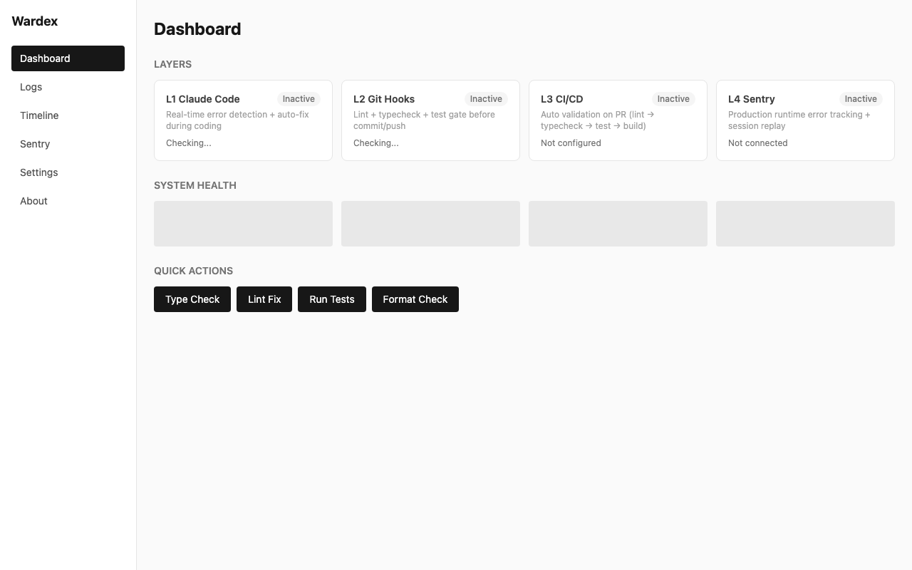
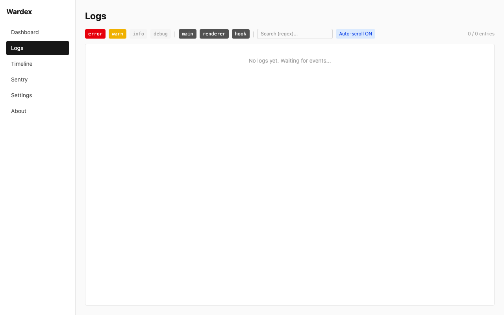
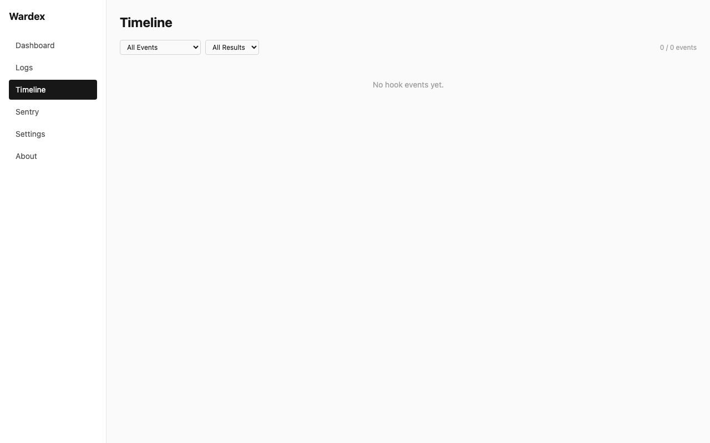
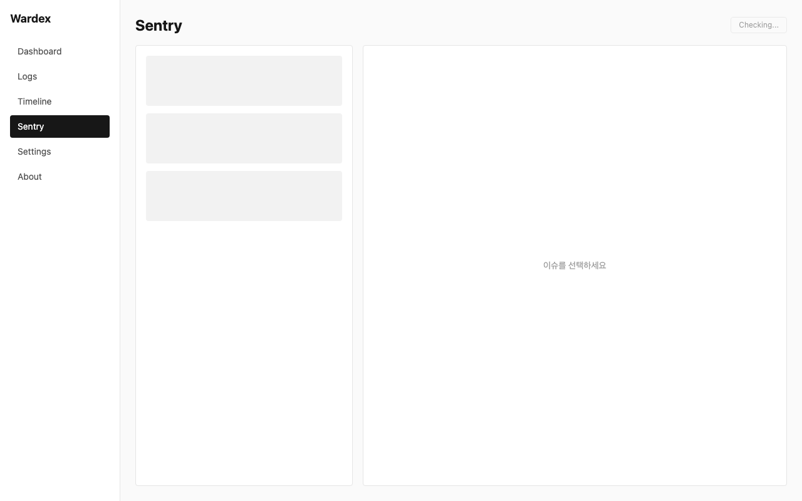
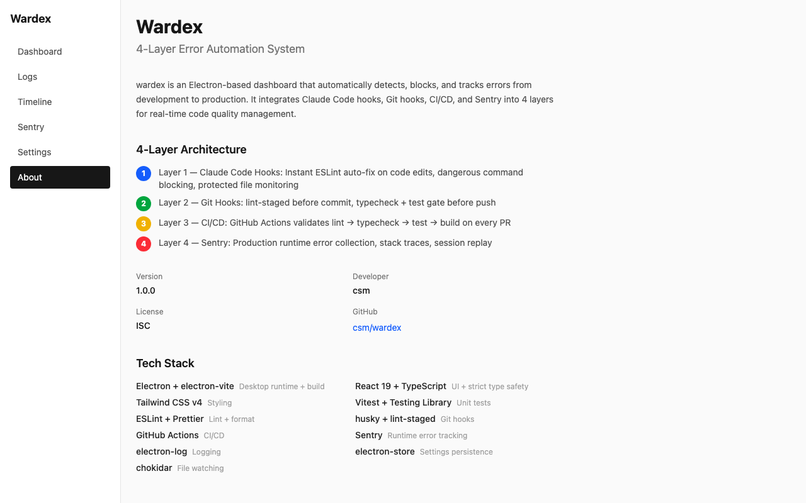

# Wardex

**4-Layer Error Automation System** — 코드 작성부터 프로덕션까지 에러를 자동 감지 + 차단 + 추적하는 Electron 대시보드

```
Write Code ──→ Commit ──→ Push ──→ Production
    │              │          │          │
   L1             L2         L3         L4
 Claude Code    Git Hooks   CI/CD     Sentry
  (실시간)      (게이트)   (검증)    (추적)
```

---

## 왜 Wardex인가?

일반적인 에러 관리는 **프로덕션에서 터진 뒤** 대응합니다. Wardex는 **에러가 코드에 진입하는 순간부터** 4단계로 차단합니다.

```
                    ┌─ L1이 잡으면 → 코드 단계에서 즉시 수정
에러 발생 ─────────┼─ L2가 잡으면 → 커밋/푸시 차단
                    ├─ L3가 잡으면 → PR 머지 차단
                    └─ L4가 잡으면 → 프로덕션 이슈 추적
```

|                    | Sentry만 사용        | Wardex                                   |
| ------------------ | -------------------- | ---------------------------------------- |
| **감지 시점**      | 프로덕션 배포 후     | 코드 작성 중 (실시간)                    |
| **대응 방식**      | 사후 대응 (reactive) | 사전 차단 (proactive)                    |
| **커버 범위**      | 런타임 에러만        | lint + type + test + runtime             |
| **위험 명령 차단** | 없음                 | `rm -rf /`, `git push --force main` 차단 |
| **보호 파일**      | 없음                 | `.env`, `package-lock.json` 편집 차단    |
| **Git 연동**       | 없음                 | pre-commit, pre-push 게이트              |
| **CI/CD 연동**     | 에러 수신만          | lint → typecheck → test → build 검증     |
| **비용**           | 이벤트 과금          | 로컬 무료 + Sentry 선택                  |

---

## 4-Layer 아키텍처

### Layer 1: Claude Code Hooks — 코드 작성 중 실시간 감시

> **언제**: Claude가 파일을 편집/생성할 때마다  
> **어디서**: `.claude/settings.json` + `.claude/hooks/*.sh`

```
Claude가 파일 편집
       │
       ├──→ PreToolUse: protect-files.sh
       │    .env, package-lock.json 편집 시도? → 즉시 차단
       │
       ├──→ PreToolUse: danger-guard.sh
       │    rm -rf /, DROP TABLE 등 위험 명령? → 즉시 차단
       │
       ├──→ PostToolUse: error-check.sh
       │    ESLint --fix 자동 실행 → 린트 에러 즉시 수정
       │
       ├──→ PostToolUse: Prettier (async)
       │    코드 포맷 자동 정리
       │
       └──→ Stop: Agent 검증
            tsc --noEmit + vitest run → 실패 시 세션 완료 차단
```

**차단하는 위험 명령**: `rm -rf /`, `DROP TABLE`, fork bomb, `mkfs.`, `chmod -R 777 /`, `git push --force origin main` 등 12+ 패턴

**보호하는 파일**: `.env`, `.env.local`, `package-lock.json`, `.git/`, `node_modules/`

모든 이벤트는 `.claude/hooks/hook-log.jsonl`에 기록 → Wardex 대시보드에 실시간 표시

---

### Layer 2: Git Hooks — 커밋/푸시 게이트

> **언제**: `git commit` 또는 `git push` 실행 시  
> **어디서**: `.husky/pre-commit`, `.husky/pre-push`

| 시점           | 실행 내용                                     | 실패 시   |
| -------------- | --------------------------------------------- | --------- |
| **pre-commit** | `lint-staged` (변경 파일만 ESLint + Prettier) | 커밋 차단 |
| **pre-push**   | `tsc --noEmit` + `vitest run` (전체 프로젝트) | 푸시 차단 |

---

### Layer 3: GitHub Actions — PR 검증 파이프라인

> **언제**: PR 생성 또는 main 브랜치 푸시 시  
> **어디서**: `.github/workflows/ci.yml`

```
PR 생성 / main 푸시
       │
       ├──→ Lint: eslint src/
       ├──→ Type Check: tsc --noEmit
       ├──→ Test: vitest run --coverage
       ├──→ Build: electron-vite build
       │
       └──→ (main만) Security Audit + Sentry 소스맵 업로드
```

하나라도 실패하면 PR 머지 차단.

---

### Layer 4: Sentry — 프로덕션 런타임 추적

> **언제**: 프로덕션에서 런타임 에러 발생 시  
> **어디서**: `@sentry/electron` (main) + `@sentry/react` (renderer)

- 미처리 예외 자동 캡처 + 스택 트레이스
- 세션 리플레이 (사용자 행동 재현)
- Wardex에서 직접 이슈 조회/해결/무시 가능
- 오프라인 캐시 지원 (네트워크 끊겨도 마지막 이슈 목록 조회)

---

## 에러 시나리오별 차단 레이어

| 에러 유형               |   L1 Claude   |  L2 Git   | L3 CI/CD | L4 Sentry |
| ----------------------- | :-----------: | :-------: | :------: | :-------: |
| ESLint 위반             | **즉시 수정** | 커밋 차단 | PR 차단  |     -     |
| TypeScript 타입 에러    | Stop에서 차단 | 푸시 차단 | PR 차단  |     -     |
| 테스트 실패             | Stop에서 차단 | 푸시 차단 | PR 차단  |     -     |
| 위험 명령 (`rm -rf /`)  | **즉시 차단** |     -     |    -     |     -     |
| 보호 파일 편집 (`.env`) | **즉시 차단** |     -     |    -     |     -     |
| 런타임 에러             |       -       |     -     |    -     | **추적**  |
| 빌드 실패               |       -       |     -     | PR 차단  |     -     |

---

## 스크린샷

### Dashboard — 4-Layer 상태 + 시스템 헬스 + 퀵 액션



### Logs — 실시간 로그 스트림 + 필터



### Timeline — Hook 이벤트 타임라인



### Sentry — 이슈 뷰어 + 스택 트레이스



### About — 프로젝트 정보 + 기술 스택



---

## 대시보드 페이지

### Dashboard — 전체 현황

4-Layer 상태 카드 + 시스템 헬스(tsc/eslint/vitest/git 병렬 실행) + 원클릭 퀵 액션

### Logs — 실시간 로그 스트림

- main/renderer/hook 3개 소스의 로그 통합 뷰
- 레벨 필터 (error/warn/info/debug) + 소스 필터
- 정규식 검색 + 자동 스크롤 + 스택 트레이스 펼치기
- Ring buffer (최대 10,000개, 기본 1,000개)

### Timeline — Hook 이벤트 타임라인

- Claude Code 훅의 모든 이벤트를 시간순 시각화
- 이벤트 타입별 필터 (PreToolUse/PostToolUse/Stop)
- 결과별 컬러 코딩: pass(녹색), block(빨간), error(노란), failure(주황)

### Sentry — 이슈 뷰어

- Sentry REST API 연동 이슈 목록 + 이벤트 상세
- 스택 트레이스, 태그, 컨텍스트 표시
- 이슈 Resolve/Ignore 직접 처리
- 오프라인 캐시 지원

### Settings — 설정

- Sentry 연결 (DSN, Auth Token, Org, Project)
- 다크 모드 토글
- 언어 전환 (한국어/English)
- 로그 버퍼 크기 설정
- Auth Token은 `safeStorage`로 암호화 저장

### About — 프로젝트 정보

- 4-Layer 아키텍처 설명
- 기술 스택 목록
- 버전/개발자/라이선스

---

## 데이터 흐름

```
┌─────────────────────────────────────────────────────────────┐
│ Layer 1: Claude Code Hooks                                   │
│                                                               │
│  protect-files.sh ──┐                                        │
│  danger-guard.sh  ──┤── 결과 ──→ hook-log.jsonl              │
│  error-check.sh  ──┘                                         │
└──────────────────────────┬──────────────────────────────────┘
                           │ chokidar 파일 감시
                           ▼
┌─────────────────────────────────────────────────────────────┐
│ Wardex Main Process (Electron)                               │
│                                                               │
│  hook-log.jsonl 변경 감지                                    │
│  → HookEvent 파싱 → IPC 'hook:event' broadcast              │
│                                                               │
│  electron-log 인터셉트                                       │
│  → LogEntry 변환 → IPC 'log:push' broadcast                 │
│                                                               │
│  health:check 요청 시                                        │
│  → tsc, eslint, vitest, git 병렬 실행 → SystemHealth 반환   │
│                                                               │
│  sentry:get-issues 요청 시                                   │
│  → Sentry REST API 호출 → 캐시 저장 → SentryIssue[] 반환    │
└──────────────────────────┬──────────────────────────────────┘
                           │ IPC broadcast
                           ▼
┌─────────────────────────────────────────────────────────────┐
│ Wardex Renderer (React)                                      │
│                                                               │
│  Timeline ← useHookEventStream() ← 'hook:event'             │
│  LogViewer ← useLogStream() ← 'log:push'                    │
│  Dashboard ← useSystemHealth() ← 'health:check'             │
│  SentryViewer ← getSentryIssues() ← 'sentry:get-issues'     │
└─────────────────────────────────────────────────────────────┘
```

---

## 기술 스택

| 역할            | 도구                                      | 버전       |
| --------------- | ----------------------------------------- | ---------- |
| Desktop Runtime | Electron + electron-vite                  | 41.x / 5.x |
| UI              | React + TypeScript (strict)               | 19.x / 6.x |
| Styling         | Tailwind CSS                              | v4         |
| Testing         | Vitest + Testing Library                  | 4.x        |
| Linting         | ESLint + Prettier                         | 10.x / 3.x |
| Git Hooks       | husky + lint-staged                       | 9.x / 16.x |
| CI/CD           | GitHub Actions                            | -          |
| Error Tracking  | Sentry (@sentry/electron + @sentry/react) | 7.x / 10.x |
| Logging         | electron-log                              | 5.x        |
| Settings        | electron-store (safeStorage 암호화)       | 8.x        |
| File Watch      | chokidar                                  | 5.x        |

---

## 시작하기

### 설치

```bash
git clone https://github.com/scokeepa/wardex.git
cd wardex
npm install
```

### 환경 변수

`env.example`을 `.env`로 복사 후 Sentry DSN 입력:

```bash
cp env.example .env
```

```env
SENTRY_DSN=https://your-key@ingest.us.sentry.io/your-project-id
VITE_SENTRY_DSN=https://your-key@ingest.us.sentry.io/your-project-id
```

> Sentry 없이도 L1~L3는 정상 동작합니다.

### 실행

```bash
npm run dev        # 개발 모드
npm run build      # 프로덕션 빌드
npm start          # 빌드된 앱 실행
```

### 검증

```bash
npm run typecheck  # tsc --noEmit
npm run lint       # eslint src/
npm test           # vitest run (34 tests)
```

---

## 프로젝트 구조

```
wardex/
├── src/
│   ├── main/                    # Electron main process
│   │   ├── index.ts             # 앱 초기화, Sentry, electron-log
│   │   └── ipc-handlers.ts      # IPC 핸들러 (health, action, sentry, hooks)
│   ├── preload/
│   │   └── index.ts             # contextBridge → window.wardex API
│   ├── renderer/src/
│   │   ├── App.tsx              # Router + Layout
│   │   ├── pages/               # 6개 페이지
│   │   ├── components/          # Badge, StatusCard, Skeleton, LogEntry 등
│   │   ├── context/             # AppContext (settings + dark mode + i18n)
│   │   ├── hooks/useIpc.ts      # IPC 구독 훅
│   │   ├── i18n/                # 한국어/영어
│   │   └── lib/sentry.ts        # Renderer Sentry 초기화
│   └── shared/
│       └── types.ts             # 모든 IPC 타입 (SSOT)
├── .claude/                     # Layer 1 — Claude Code 훅
├── .husky/                      # Layer 2 — Git 훅
├── .github/workflows/           # Layer 3 — CI/CD
└── docs/                        # 설계 문서 (15개)
```

---

## 라이선스

ISC
